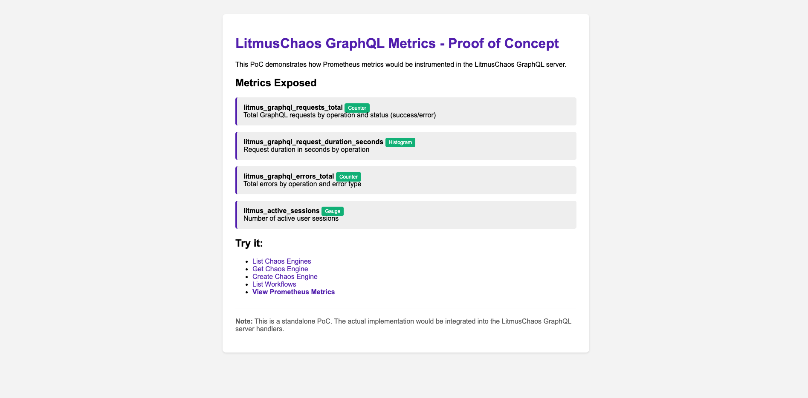
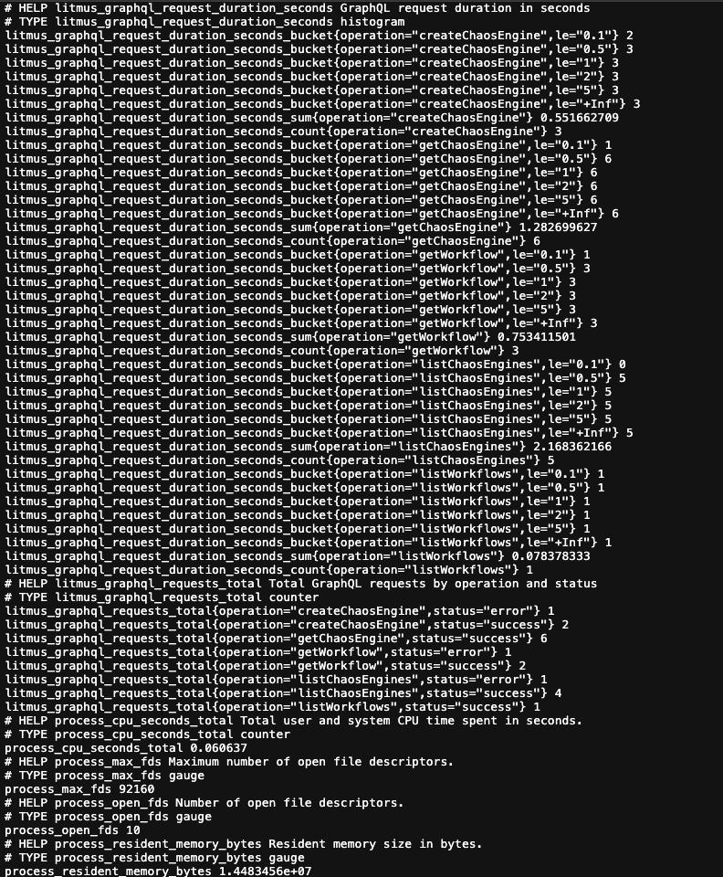

# GraphQL Metrics Proof-of-Concept

A standalone PoC showing how Prometheus metrics could be added to the LitmusChaos GraphQL server.

## What's implemented

**Metrics:**
- `litmus_graphql_requests_total` (Counter) - Requests by operation and status
- `litmus_graphql_request_duration_seconds` (Histogram) - Request latency
- `litmus_graphql_errors_total` (Counter) - Errors by operation and type
- `litmus_active_sessions` (Gauge) - Active user sessions

**Concepts covered:**
- Counter, Gauge, and Histogram usage
- Label design (operation, status, error_type)
- Histogram buckets for duration tracking
- `/metrics` endpoint in Prometheus format

## Screenshots

**Homepage:**



**Metrics Endpoint:**



## Running it
```bash
go run main.go
```

Then visit:
- http://localhost:8080 - Homepage
- http://localhost:8080/metrics - Prometheus metrics
- http://localhost:8080/graphql?operation=listChaosEngines - Sample request

## How this relates to LitmusChaos

This follows the same pattern I'd use for the actual implementation:

1. GraphQL Server - Instrument request handlers (like this PoC)
2. Auth Server - Add login/token metrics
3. Chaos Operator - Track reconciliation loops
4. Experiment Pods - Track experiment lifecycle

The PoC is standalone to keep it simple, but the approach translates directly to the real codebase.
